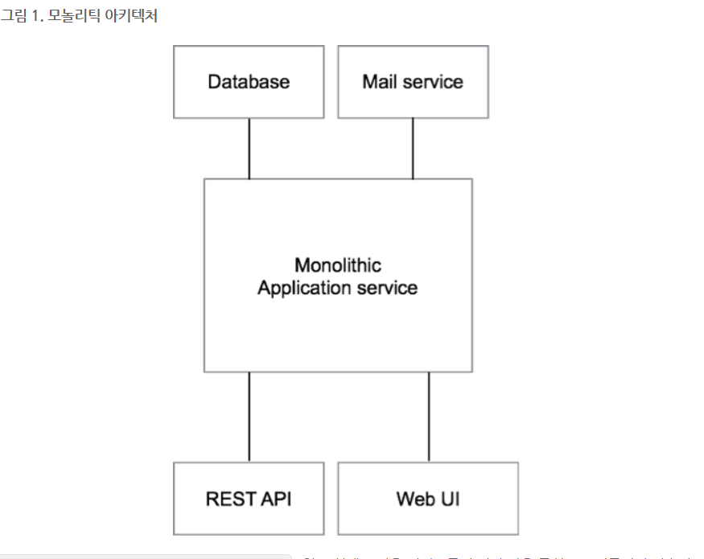
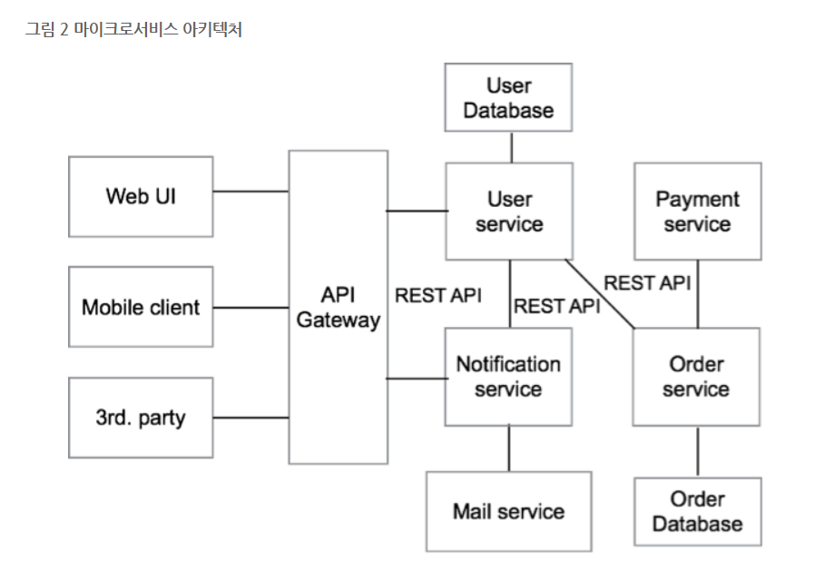

Plug-in 및 각종사용법과 정의들
===

*  **[eclipse.diff](http://mainia.tistory.com/1273)**
    1. 그전 코드와 변경된걸 보여줌
        > < branch-merge >
가장 유용한 기능이라고 할수 있다
개발자는 각각의 branch를 사용하고 나중에 병함(merge)할때에 합치면 된다 . 충돌이 안나게 하기위해서는 각자 맡은곳만 수정하는것이 좋다 그이유는 충돌이 날수 있기때문이다.

        >< origin, master >
origin은 내 원격저장소의 별명같은 것이라고 보면 되고  
master만  붙은게 있고 orgin/mater라고 붙은게 있는데 master의 경우는 내 로컬 저장소를 뜻하고 origin/master는 원격저장소를 뜻한다.

* **[sourceTree사용법](https://www.evernote.com/shard/s3/sh/128acb97-d3c5-4eda-aa1b-c71ecd2f3a15/54a14ebd5d4ce7507bf78e5af640d0e9)**
  1. 파일 수정한 부분이 나오는 곳이 working copy 체크하는 것이 add  add해서 등록되는 곳이 index  commit해서 등록되는 곳이 repository(저장소)
* **[github sourceTree사용법(stash)](https://opentutorials.org/course/1492/8121)**
  1. 아직 다 작성되지 않은파일을 안전한곳에 잠시 보관하는 장소

* **[github sourceTree사용법(pull&push)](https://opentutorials.org/course/1492/8117)**
  1. pull 원격저장소에 변경된 사항들을 local저장소로 다운받는것
push: loacal저장소에 있는 변경사항들을 원격저장소로 올리리는것을 push

* **[github sourceTree사용법(revert)](https://opentutorials.org/course/1492/8044)**
  1. reset과 revert가 있는데 reset과revetr의 차이는 revert의 경우는 원래 상태로 되돌리긴하는데 새로운 commit을 하면서 되돌리는 것이다. reset은 삭제 하는것임
revert 할경우는 역순으로 가면서 하나씩 해줘야함

* **[markdown 사용법](https://www.evernote.com/shard/s3/sh/128acb97-d3c5-4eda-aa1b-c71ecd2f3a15/54a14ebd5d4ce7507bf78e5af640d0e9)**
  1. 일반 텍스트 문서의 양식을 편집하는 문법이다[1]. README 파일이나 온새라인 문서, 혹은 일반 텍스트 편집기로 문서 양식을 편집할 때 쓰인다. 마크다운을 이용해 작성된 문서는 쉽게 HTML 등 다른 문서형태로 변환이 가능하다.
* **[JQuery 달력  plug-in](https://translate.google.co.kr/translate?hl=ko&sl=en&u=https://www.jqueryscript.net/tags.php%3F/Calendar/&prev=search) 및 [사용방법](http://iwbtbitj.tistory.com/98)**
  1. 추후에 이용할 일이 많을거 같다. 날짜별로 스케쥴 관리하는 프로그램들도 있고, 그리고 게시판에서도 날짜별로 등록글을 볼수 있게 할수도 있게 끔 만드는데 필요할수 있을거 같다.
* **[Java  용어에 대한 정리 ](http://rockdrumy.tistory.com/214)**
  1. **static**
      * 우선 인스턴스를 생성하면 각각의 인스턴스들은 서로 독립적이기때문에 서로다른값들을 가지게 된다. 하지만 따라서 각 인스턴스들이 공통적으로 같은 값을 유지해야 하기때문에 그럴때 static을 사용한다.
      예를들어서 카드게임이 있다고 하면 카드의 넓이나 크기들은 똑같지만 무늬나 숫자같은 경우는 계속 바뀌게 된다. 이럴때  static을 어디에 적용해야 할까? 바로 넓이나 높이에 대한 인스턴스에 static을 붙이게 되면  그 값을 계속 유지하게 되는 것이다.  이러한 장점뿐만아니라 static이 붙은 메서드는 따로 인스턴스를 생성하지 않고  즉 , MemberDAO dao = new MemberDao() 이런식으로 객체를 생성하지 않아도 그냥 dao.내가 원하는 함수(); 이런식으로 불러올수 있다.
      그래서 속도면에서도  인스턴스 생성하는 방식보다 빠르다고 할수 있다.
<예제>
        class Jaehun{
        int age=35;

        static int key= 185;
        int age2=36;
        static void Jaehun2(){
        System.out.println(age);
        static 변수가 아니기때문에 객체를 생성하고 써먹어야 한다 써먹기 위해서는
        Jaehun j= new Jaehun();
        System.out.println(j.age);
        이런식으로 인스턴스를 생성한 후에 사용할수 있다.
        System.out.println(key);  
        staitc 변수이기 때문에 그냥 호출 가능
        }
        void Jaehun3() {
        System.out.println(age);  
        인스턴스 메소드에서는 바로 불러오는게 가능하다.
        System.out.println(age2);
        System.out.println(key);
        	}
        }
  2. **subString,lastIndex**
      *  마지막으로 발견된 문자열을 모두 반환하게 된다. 예를들어서
            String name="jaehuniya";

            System.out.println(name.lastIndexOf("a"));  8출력
            System.out.println(name.indexOf("a"));  1출력
            System.out.println(name.subString(2));  jae출력

  3. **toUpeerCase()** 모든 문자열을 대문자로 치환한다.
  4. **File(File parent,String child):** parent 객체 폴더의 child 라는 파일에 대한 file객체를 생성한다. 쉽게 말하면 parent 폴더의 child랄 파일의 객체를 생성한다는 의미.
  5. **File.selector:** " / " ," \ "같은 파일의 경로를 분리해주는 메소드이다.
  6. **[DecimalFormat()](http://javafactory.tistory.com/1225):** 특정메소드를  형식으로 바꾸는 것 즉, DecimalFormat("00") 이런식으로 하면 형식은 십의자리로 바꾸겠다는 소리임
  7. **[getQueryString](https://way2java.com/servlets/request-getquerystring-method-example-servlets/):** form 필드의 이름과 사용자가 필드에 입력한 데이터가 들어있는 문자열을 queryString인데 getQueryString() 메소드를 사용하면 경로뒤에 요청한 URL에 포함된 쿼리 문자열을 반환한다.
  8. **[HttpSession](http://genesis8.tistory.com/220):** 실제로 세션쿠키를 통해서 이루어진다. 즉, 서버는 필요한 경우에 접속한 브라우저에 고유한 세션 쿠키를 전달하고, 매번 브라우저 서버를 호출할때에 세션을 가지고 있기때문에 세션쿠키를 열쇠처럼 사용해서 필요한 데이터를 가지고온다. 즉 , **HttpSession은 필요한 데이터를 가지고 있는 저장소라고 한다면 session cookie는 HttpSession에 담겨져 있는 데이터를 가지고 올수 있는 열쇠의 역할을 한다고생각하면 쉽다.** 너무많은 세션을 가지고 있으면 서버의 성능에 영향을 미치기 때문에 자동으로 일정시간이 지나면 세션을 정리하는 기능이 있다. 아니면 사용자가 직접 web.xml에 세션 time-out을 지정해서 사용해서 유지시간을 설정해줄수 있다.

* **[데이터 바인딩](https://m.blog.naver.com/PostView.nhn?blogId=yjkang23&logNo=80040165420&proxyReferer=https%3A%2F%2Fwww.google.co.kr%2F)**
    **1. 화면에서 보이는 객체와 데이터를 일치시키는것이 중요하다.**
  즉 웹페이지의 경우는 html과 데이터가 함께 공존한다. 이때 사용자는 데이터를 조작하기 위해서 서버에 요청하고 서버는 데이터를 엑세스하고 이걸 다시 사용자의 요구사항에 맞는 형식으로 만든후에 다시 view에 전송한다. 이러한 번거로움이나 문제를 해결하는것이 데이터 바인딩으로서 데이터와html을 구분하여 데이터를 조작하기 대문에 서버에서 왔다갔다 할필요가 없어진다. **즉 게시판을 만들때 썼던 handlebar 템플릿이 바로 바인딩 역할을 하게 해주는 템플릿이다 .** (html 크드에서 데이터만뽑아오니까)
  순서는
  * **핸드바 템플릿 가지고오기**
  * **핸드바 템플릿 컴파일하기**
  * **데이터 바인딩하기**
  * **결과물을 DOM 에 추가**
* **[프로그래밍인강1](https://programmers.co.kr/learn/courses/2):**  프로그래머스 인강사이트
* **[프로그래밍인강2](https://opentutorials.org/course/1):** 생활코딩
* **Chrome에서 쿠키정보보기**
  1.  F12로 개발도구를 연다
  2. Application 클릭 --> 왼쪽에 Cookies 를 클릭하면 현제 쿠키정보를 볼수 있음.

* **검색하는 요령**
  1. 검색은 무조건 google.com 에서 해야한다
  2. 검색 키워드에는 키워드에 무조건 자신이 원하는 언어를 넣어라
    ex) 파이선이면 python3  spring이면 spring4 나 spring3 이런식으로
  3. 코드를 포함한 글을 찾도록 하자
  4. 간단한 예제는 REPL을 사용해서 해보자
  5. 영어를 못해도 영어로 검색하자

* **공식문서에서 찾는 요령**
  1. 검색하고자 하는 내용 다음 site:python.org 를 넣어주면된다. 그럼 해당 사이트의 공식문서만 보여줌
  ex) spring 4.0 today radom site:spring.io 이런식으로 검색을 하면 그 해당 공식페이지에서 원하는 것을 검색할수 있다.
  2. 공식문서에서 어떻게 쓰는지를 알았으면 다시 검색해서 더 정확한 답변을 얻을수도 있을 것이다.

 **[MSA](http://guruble.com/%EB%A7%88%EC%9D%B4%ED%81%AC%EB%A1%9C%EC%84%9C%EB%B9%84%EC%8A%A4microservice-%EC%95%84%ED%82%A4%ED%85%8D%EC%B2%98-%EA%B7%B8%EA%B2%83%EC%9D%B4-%EB%AD%A3%EC%9D%B4-%EC%A4%91%ED%97%8C%EB%94%94/)(Macro Service Architecture):마이크로 서비스 아키텍쳐**

* **Monolithic Architecture**
  출처:GURUBLE BLOG
    * 지금 현재 가장 일반적으로 많이 사용하고 있는 방식이 모놀로틱 아키텍쳐 방신이다
    
    이러한 방식이 나쁘다고 말하는 것이 아니다. 이렇게 단순한 구성의 어플리케이션의 경우는 모든코드가 하나의 묶음으로 구성되어 있기때문에 매우 간편해지고 유지보수가 더 쉽기 때문에 소규모 프로젝트에선 마이크로 서비스 아키텍쳐 보다 더 효율적일 수가 있다.
    하지만, 프로젝트의 규모가 커지면서 수십명이 넘는 개발자가 동시에 일하면서 복잡도가 증가하게 되면 하나의 간단한 변화에도 테스트가 필요하게 되고, 코드 하나의 변화가 미치는 범위가 증가하게 된다.  
    여기서 내가 생각한것은 Spring의 MVC의 생각을 했다. DitpatcherServlet  과 Model2 방식을 이용해서 서로 나누면 하나의 코드가 변해도 수정하기가 용이하다. 그런 의미와 비슷한 개념으로 마이크로 서비스 아키텍쳐가 나온거라는 생각을 해보았다.

    * **MSA(Micro Service Architecture)**    
    

  마이크로서비스 아키테처는 모놀리틱 아키텍저로 구성된 하나의 큰 서비스를 독립적인 역할을 수행하는 작은 단위의 서비스로 분리하여 설계하는 패턴이다. 여기서 보면 중요한것은 Gateway 이다. 게이트 웨이를 통해서 정보를 웹브라우저 화면에 표시하거나 모바일 클라이언트에 데이터를 제공합니다. (왠지 스프링의 DispatcherServlet 과 비슷해보이는 것은 나만그런가?) 그리고 특이한점이 데이터 베이스나 서비스해주는 영역도 모두 구분지어서 나누어 놓은것을 볼수 있다. 이것만봐도 나중에 개발할때 아니면 유지보수 할때  다른 코드에 영향을 많이 안미치게 할수 있는 것을 알수 있다.
    * MSA 장점
      1. 서로 독립적인 어플리케이션으로 이루어져 있기 때문에 **다른 코드들에 대한 의존성이 떨어지기때문에 유지보수 측면에서 좋다.**
      2. 서비스의 특성에 따라서 메모리 사용이 많은 서비스도 있을 수 있고, 계산 과정이 많아서 CPU 사용량이 많은 서비스가 있을 경우 서비스의 특성에 맞게 자원을 할당하여 스케일 아웃할 수 있기 때문에 **효율적인 자원사용이 가능하게 됩니다.**
      3. 서비스의 규모가 커지고 시스템이 복잡해지면 사소한 변경 하나가 발생시킬 수 있는 문제(side effect)가 많아지고, 이 때문에 조직은 복잡한 시스템에 맞는 복잡한 프로세스를 필연적으로 가지게 됩니다. 마이크로서비스 아키텍처의 가장 큰 장점은 특정 서비스의 변경이 **다른 서비스에 영향을 미칠 가능성이 적다는 점과 서비스 단위로 독립적인 배포가 가능하다는 점 입니다**
    * MSA 단점
      1. 모놀리틱 아키텍처에 비해 서비스 간의 통신에 대한 처리가 추가적으로 필요하다는 점입니다. 이것은 단순히 개발해야 하는 코드의 양이 늘어난다는 점 뿐만 아니라, 사용자의 요청을 처리하기 위한 응답속도의 증가에도 영향을 미칩니다
      2. , 분산된 데이터베이스는 트랜잭션 관리가 용이하지 않기 때문에 데이터의 정합성을 맞추기 위한 노력이 추가적으로 필요합니다. 그림에서 봤다시피 서로 독립적인 데이터베이스를 가지고 있으며 데이터베이스의 종류 까지도 다를수가 있기때문에 개발과정에서 데이터베이스에 대한 고려까지도 해야 한다는 점이다.
      3. 마지막으로 배포를 할때 독립적이다 보니 관리 할때에도 그만큼 어려움을 가질수 밖에 없다.  
